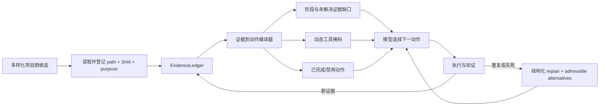

# GameAgent 下一步研究方案：从描述性记忆到证据驱动控制

日期：2026-07-31

## 1. 研究起点

真实 `qwen-plus` 实验给出了两个互补结果：

- baseline 在 19 次模型调用、78,006 tokens 后定位到根因文件，但用 PowerShell
  写入了非法字面 `\n`，随后因总 token 超限停止；
- 创新组把总消耗降到 23,238 tokens，真实启用了项目图、虚拟上下文和
  `code_file_read`，但连续三次选择同一个测试文件，触发重复动作门控，未进入修改。

创新组的正向信号是上下文有界、查询可审计、隐藏验证能阻止公开测试假阳性。
负向信号不是简单的“没有记忆”，而是：

1. 初始图检索的 4 个槽位中，3 个属于同一个 PlayMode 测试文件；
2. 测试文件、类和方法都被赋予 1.0 的建议置信度，形成错误先验；
3. 两次读取后，EvidenceLedger 已保存相同路径和 SHA-256，但该事实没有改变动作空间；
4. 控制器只在第三次重复时终止，没有提供可接受的替代动作；
5. 28 个静态工具 schema 持续占用输入预算；
6. ACI 查询没有进入统一 `tool_start/tool_end` 事件，StageAnalyzer 将其统计为零。

因此，当前核心矛盾是：

> 系统已经能够保存证据，却还不能让证据可靠地约束下一步行为。

## 2. 相关研究给出的可迁移机制

- [SWE-agent](https://arxiv.org/abs/2405.15793) 表明 ACI 设计本身会显著影响软件
  智能体行为，因此不应把当前失败简单归因于基础模型。
- [AutoCodeRover](https://arxiv.org/abs/2404.05427) 和
  [CoSIL](https://arxiv.org/abs/2503.22424) 都强调结构化、迭代式代码定位，
  而不是一次性把最高分节点塞入上下文。
- [ToolLLM](https://arxiv.org/abs/2307.16789) 使用 API retriever 缩小工具集合；
  [ToolRet](https://arxiv.org/abs/2503.01763) 进一步说明普通检索器并不天然擅长
  工具检索，工具选择必须单独评估。
- [HiAgent](https://arxiv.org/abs/2408.09559) 用子目标组织工作记忆，
  [Agent Workflow Memory](https://arxiv.org/abs/2409.07429) 则保存可复用流程；
  二者都支持将记忆从“历史摘要”升级为“当前过程状态”。
- [Structured Reflection](https://openreview.net/forum?id=J6pq6AcmbE) 使用 disabled
  action set 防止重复失败动作，并强制执行反思产生的替代动作。这与本次重复读取
  失败高度同构。
- [Lost in the Middle](https://arxiv.org/abs/2307.03172) 说明信息存在于长上下文
  并不等于模型能稳定使用它，因此仅继续增加 EvidenceLedger 文本不是充分方案。
- [DF-RAG](https://arxiv.org/abs/2601.17212) 用查询相关的多样化重排减少冗余检索，
  可迁移到“同一路径的文件/类/方法占满工作集”的问题。
- [VeriHarness](https://arxiv.org/abs/2607.14167) 的近期预印本报告：仅返回错误位置
  和观测值帮助有限，显式给出 admissible alternatives 才带来主要修复增益。
  该结果需要在本项目中独立复现，但与当前门控只会终止、不会恢复的问题一致。
- [MemGym](https://arxiv.org/abs/2605.20833) 主张把记忆质量从推理、检索和工具能力
  中分离评估，适合解决当前“StageAnalyzer 显示零工具调用”的指标混淆。

## 3. 发散候选池

| 编号 | 候选机制 | 主要解决的问题 |
|---|---|---|
| C1 | 按源文件折叠图节点，同一路径只占一个初始槽位 | 文件/类/方法重复占满 Top-K |
| C2 | role-aware 检索：修复任务默认限制测试文件配额 | 测试文件过预测 |
| C3 | MMR/覆盖率重排，奖励路径、节点种类和子系统多样性 | 相关性与覆盖率失衡 |
| C4 | 从建议节点沿调用、事件订阅、序列化引用边迭代扩展 | 一次性检索缺少因果链 |
| C5 | 图置信度校准：区分归一化排名分与真实概率 | 多个候选被错误标成 1.0 |
| C6 | 已读注册表：`path + sha + line range + purpose` | 证据存在但无法判定动作重复 |
| C7 | action mask：成功读取后禁止同签名重复读取 | 重复工具循环 |
| C8 | 重复动作触发强制 replan，并返回 2–3 个可接受替代动作 | 门控只能终止、不能恢复 |
| C9 | frontier memory：显式记录“已知/未知/下一证据缺口” | 模型不知道下一步为何不同 |
| C10 | 子目标有限状态机：定位→读实现→诊断→修改→验证→提交 | 线性上下文缺少阶段承诺 |
| C11 | 阶段化工具暴露，每阶段只发送必要 schema | 28 个工具持续占用预算 |
| C12 | 工具检索器，根据当前阶段和证据缺口动态选 5–8 个工具 | 静态工具集合稀释选择 |
| C13 | 结构化验证反馈：位置、观测值、可接受替代方案 | 验证失败后修复信息不足 |
| C14 | PowerShell 写操作纳入 checkpoint/验证协议 | baseline 可绕开类型化 ACI |
| C15 | ACI 事件统一为标准 tool telemetry | 创新组指标被统计为零 |
| C16 | memory-isolated evaluator：分别评分写入、检索、利用和动作 | 无法判断是记忆还是推理失败 |

## 4. 收敛与排序

评分采用五项各 1–5 分：问题直接性、预期收益、实现可行性、可消融性、研究新颖性。

| 排名 | 研究方向 | 直接性 | 收益 | 可行性 | 可消融 | 新颖性 | 总分 |
|---:|---|---:|---:|---:|---:|---:|---:|
| 1 | 证据到动作编译器（C6–C10） | 5 | 5 | 4 | 5 | 5 | 24 |
| 2 | 路径折叠的角色感知多样化图检索（C1–C5） | 5 | 5 | 5 | 5 | 4 | 24 |
| 3 | 阶段化动态工具暴露（C11–C12） | 4 | 4 | 4 | 5 | 4 | 21 |
| 4 | 验证驱动修复闭环（C13–C14） | 4 | 5 | 3 | 5 | 4 | 21 |
| 5 | 记忆隔离评测与统一 telemetry（C15–C16） | 5 | 3 | 5 | 5 | 3 | 21 |

不建议优先做：

- 继续扩大 working set 或模型上下文：实验已表明信息量不是主要缺口；
- 直接提高重复动作上限：只会延后失败并消耗更多 tokens；
- 立即引入多 Agent：当前失败发生在单个明确子目标内，多 Agent 会增加变量与成本；
- 直接训练记忆模型：现阶段尚未证明简单的确定性控制层不足。

## 5. 推荐主线：Evidence-Conditioned Control Plane

### 两句话研究陈述

软件工程 Agent 即使拥有项目图和结构化记忆，仍会重复读取和偏离根因，因为证据只是
提示文本，没有改变后续可执行动作。我们把证据编译成阶段状态、已完成动作集合、动态
工具掩码和可接受恢复动作，使记忆从描述性上下文升级为可执行控制策略。

### 核心张力

- 自由 Agent 具有适应性，但容易循环和绕开协议；
- 强状态机可靠，但可能过度限制探索。

研究目标不是完全脚本化 Agent，而是只在证据充分或失败可判定时收缩动作空间：



### 最小控制状态

```json
{
  "phase": "evidence_verification",
  "goal": "read at least one implementation source on the state/UI path",
  "completed_actions": [
    {
      "signature": "code_file_read:Assets/Tests/PlayMode/KitchenGameManagerPlayModeTests.cs:1-53",
      "result_sha256": "db482e...",
      "claim": "test describes CountdownToStart -> GamePlaying only"
    }
  ],
  "unresolved_slots": [
    "implementation handler for start interaction",
    "state-change event consumed by TutorialUI and CountdownUI"
  ],
  "disabled_actions": [
    "code_file_read:Assets/Tests/PlayMode/KitchenGameManagerPlayModeTests.cs:1-53"
  ],
  "admissible_next_actions": [
    "code_symbol_search(GameInput_OnInteraction)",
    "code_file_read(Assets/Scripts/KitchenGameManager.cs)",
    "code_find_references(OnStateChanged)"
  ],
  "available_tool_classes": ["code_query", "artifact_read"]
}
```

关键点是 `completed_actions` 不能只有“读过某文件”，还要保留读取目的和结论；否则
相同文件的不同 line range 或不同证据目标会被错误阻止。

## 6. 三个核心实验

### E1：图检索多样性与定位质量

条件：

1. 当前纯相关性 Top-K；
2. 按 path 折叠；
3. path 折叠 + 测试文件配额；
4. path 折叠 + role-aware MMR + 一跳因果边扩展。

主要指标：

- root-cause file Recall@4、MRR；
- 初始候选 distinct path ratio；
- test dominance ratio；
- 首次读取实现文件所需模型调用和 tokens；
- 最终 verified success。

关键预测：本任务初始四槽位不应再出现三个同路径测试节点，且
`KitchenGameManager.cs` 应在前四个 distinct paths 中。

### E2：重复动作后的恢复策略

条件：

1. 当前 warning + 第三次 hard stop；
2. 仅 action mask；
3. action mask + 普通 replan；
4. action mask + `location/observed/admissible alternatives` 结构化 replan。

主要指标：

- duplicate action ratio；
- hard-stop recovery rate；
- unique evidence gained per model call；
- 从第一次重复到下一有效证据的 calls/tokens；
- verified success。

关键预测：仅放宽重复阈值无效；显式替代动作应显著提高恢复率。

### E3：动态工具集合与控制协议

条件：

1. 全部 28 工具；
2. 手工阶段工具集合；
3. 基于 phase + unresolved slots 的工具检索；
4. 动态工具集合 + 类型化写操作强制路由。

阶段建议：

- 定位：`code_symbol_search`, `unity_asset_search`, `code_find_references`,
  `code_file_read`, `artifact_read`;
- 修改：目标专用 typed mutation、`code_diagnostics`;
- 验证：`unity_recompile`, `unity_validate`, `artifact_read`, `submit`.

主要指标：

- 每轮 tool-schema tokens；
- 正确工具 Recall@K；
- 格式错误和无效工具率；
- typed mutation / escape-hatch ratio；
- 控制协议完成率和 verified success。

## 7. 完整消融矩阵

| 组别 | 图多样化 | 证据动作编译 | 动态工具 | 结构化验证反馈 |
|---|---|---|---|---|
| A0 baseline | 否 | 否 | 否 | 否 |
| A1 current innovation | 否 | 否 | 否 | 否 |
| A2 retrieval only | 是 | 否 | 否 | 否 |
| A3 control only | 否 | 是 | 否 | 否 |
| A4 retrieval + control | 是 | 是 | 否 | 否 |
| A5 + dynamic tools | 是 | 是 | 是 | 否 |
| A6 full | 是 | 是 | 是 | 是 |

必须保持一致：任务、缺陷注入、模型、温度、总 token、Unity 版本、公开测试和隐藏 oracle。
至少报告三个随机种子；若预算不足，先用离线轨迹回放筛掉明显无效配置，再运行真实模型。

## 8. 评测设计修正

当前单一 `verified_success` 不足以诊断研究机制，建议增加：

### 检索层

- `distinct_paths_at_k`
- `test_node_ratio_at_k`
- `root_cause_mrr`
- `causal_edge_coverage`

### 记忆层

- `evidence_write_recall`：工具结果中应保存的事实是否写入；
- `evidence_read_recall`：下一轮是否呈现必要事实；
- `evidence_utilization`：动作是否与已读/未决状态一致；
- `stale_evidence_rate`。

### 控制层

- `duplicate_action_ratio`
- `blocked_action_recovery_rate`
- `admissible_action_acceptance`
- `phase_regression_count`
- `protocol_gate_completion`

### 工具与成本

- `tool_schema_tokens_per_call`
- `unique_evidence_per_1k_tokens`
- `typed_mutation_ratio`
- `escape_hatch_ratio`

ACI 查询、mutation 和 validation 都必须发出统一 `tool_start/tool_end`，并保留：
`tool`, `arguments_hash`, `action_signature`, `node_ids`, `changed_paths`,
`evidence_ids`, `returncode`, `blocked_reason`。否则 StageAnalyzer 无法公平比较。

## 9. 两周 pilot

### 第 1–2 天：测量闭环

- 统一 ACI telemetry；
- 加入上述 retrieval/memory/control 指标；
- 用现有轨迹写 replay 测试，确保两次执行的 `code_file_read` 被计数，第三次记为 blocked。

### 第 3–5 天：多样化图检索

- path-level collapse；
- implementation/test role 分类；
- MMR 重排与测试配额；
- 使用现有任务和 4–6 个注入缺陷做离线 localization evaluation。

### 第 6–8 天：证据到动作编译器

- action signature 与 completed/disabled registry；
- unresolved slots；
- 重复动作触发结构化 replan；
- 对相同路径不同范围、文件变化后新 SHA、失败读取设计边界测试。

### 第 9–10 天：动态工具暴露

- 定义 localization/implementation/validation 三套最小工具集合；
- 记录 schema token；
- 确保 mutation 后不能隐藏必要验证工具。

### 第 11–14 天：真实模型 pilot

第一阶段离线筛选 A1–A6；第二阶段只保留 A1、A4、A6 做真实模型：

- 3 类任务：脚本事件缺失、Prefab/SerializedProperty 错误、Component 缺失；
- 每类 3 个种子；
- 共 27 次主实验，失败可重放但不人工修改轨迹；
- 主要终点：hidden-oracle verified success；
- 次要终点：定位 MRR、重复率、恢复率、schema tokens、escape-hatch ratio。

### Pilot 成功门槛

- root-cause Recall@4 提高至少 25 个百分点；
- duplicate action ratio 降低至少 50%；
- 不提高总 token 预算的情况下，blocked-action recovery ≥ 60%；
- A6 verified success 高于 A1 至少 2/9 个任务；
- 类型化修改场景 escape-hatch ratio ≤ 25%。

## 10. 最强反对意见

**反对意见：** 如果控制器给出可接受动作并限制工具，系统只是把任务脚本化，成功不再
来自 Agent 推理。

**回应与验证：**

- 控制器只根据可机器验证的事实收缩动作，不直接选择最终补丁；
- 保留 `powershell`/`unity_execute_csharp` 作为有审计的 escape hatch；
- 单独报告 controller intervention rate；
- 增加未见过的故障类型，检查控制策略能否泛化；
- 对比 action mask、admissible alternatives 和硬编码下一动作，确认收益不是来自答案泄漏。

## 11. 研究判断

最有潜力形成独立贡献的方向不是“Unity 项目图 Agent”，而是更一般的：

> **Evidence-Conditioned Control for Software Agents**：将项目检索、工具证据和验证结果
> 编译成可执行的动作约束与恢复协议，在不训练基础模型的情况下减少长任务循环和协议
> 绕过。

Unity 是适合的高约束实验场：Scene、Prefab、SerializedProperty、脚本编译和
EditMode/PlayMode 提供了比普通仓库更丰富、可机器验证的状态变化。若该机制在 Unity
任务上成立，再向 SWE-bench 类代码修复迁移，会比单纯报告一个领域工具集合更有研究价值。
